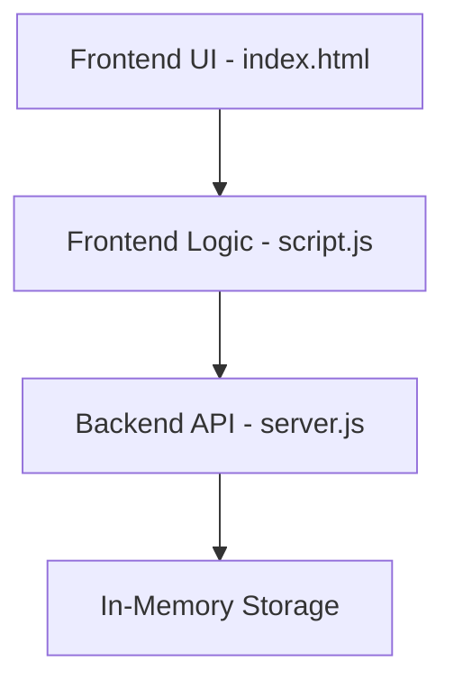
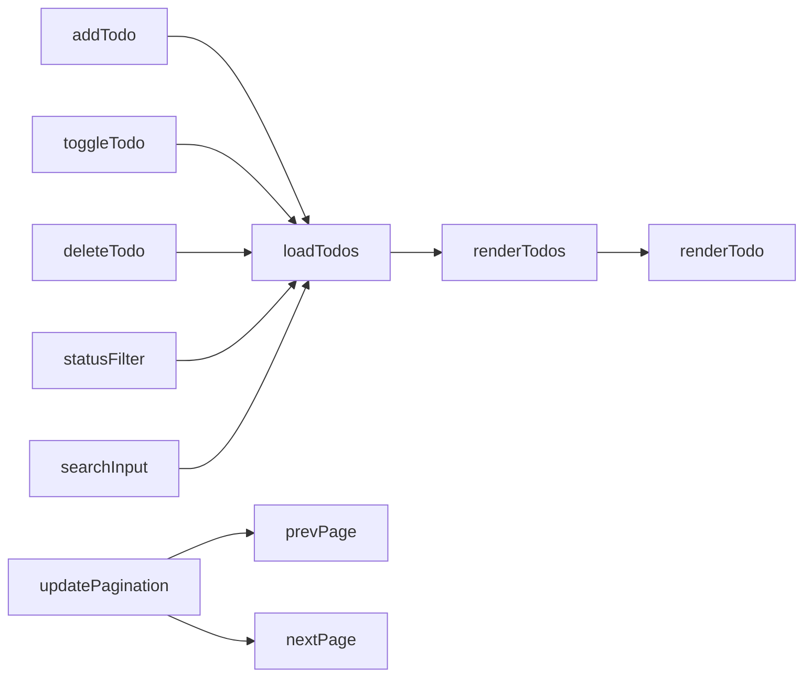
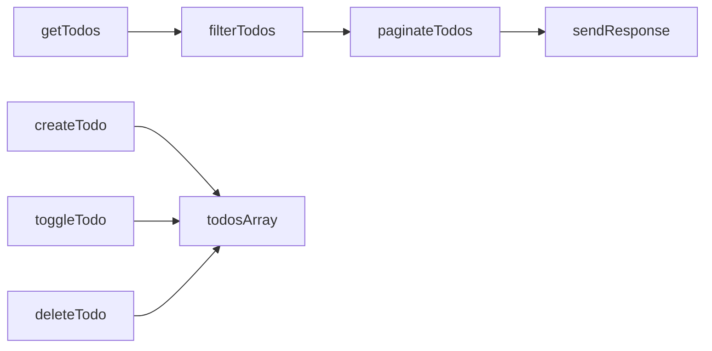

# Todo List Architecture Documentation

## Component Overview

## Frontend Component Flow

## Backend Component Flow

## Data Flow

### Frontend to Backend Flow
1. User interactions trigger frontend functions (addTodo, toggleTodo, deleteTodo)
2. Frontend functions make API calls to backend endpoints
3. Backend processes requests and updates in-memory storage
4. Response sent back to frontend
5. Frontend updates UI based on response

### State Management
- Backend maintains todos array in memory
- Frontend maintains:
  - Current page number
  - Total pages
  - Search timeout for debouncing
  - Filter state
  - Search query state

### Error Handling
- Frontend displays error messages for 3 seconds
- Backend returns appropriate HTTP status codes
- API calls wrapped in try-catch blocks

## Component Responsibilities

### Frontend Components
- **index.html**: Structure and UI elements
- **styles.css**: Visual styling and responsiveness
- **script.js**: 
  - API integration
  - DOM manipulation
  - Event handling
  - State management
  - Error handling

### Backend Components
- **server.js**:
  - REST API endpoints
  - Data storage
  - Request validation
  - Response formatting
  - Pagination logic
  - Filter implementation
  - Search functionality